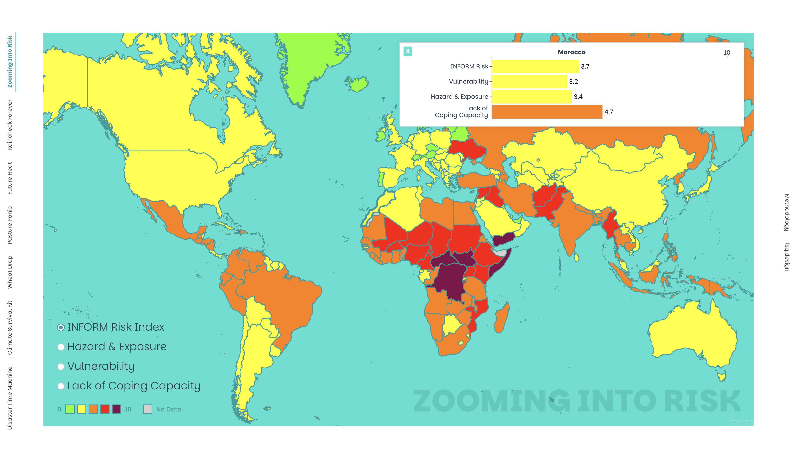
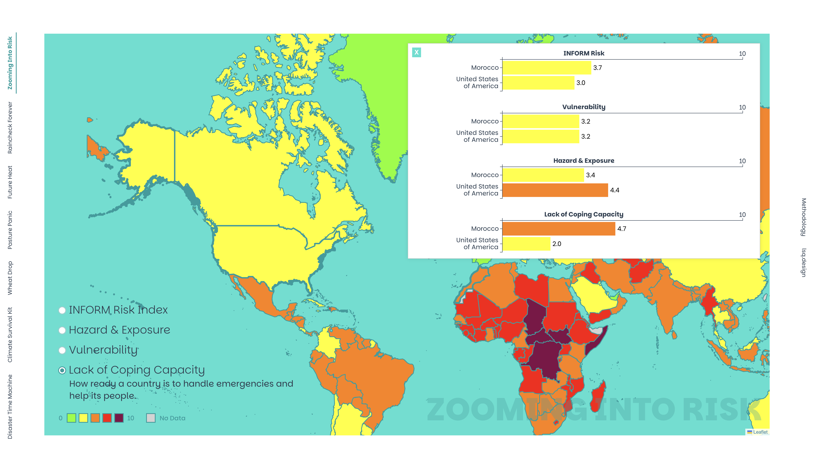
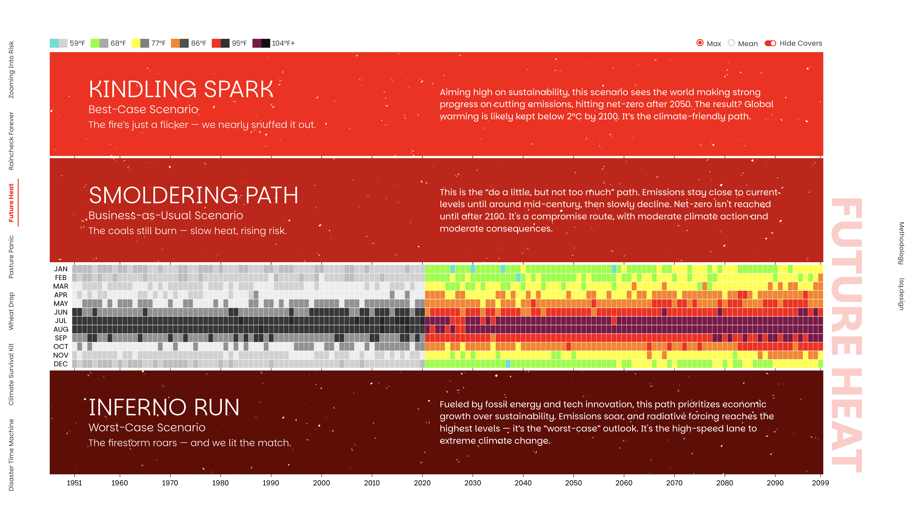
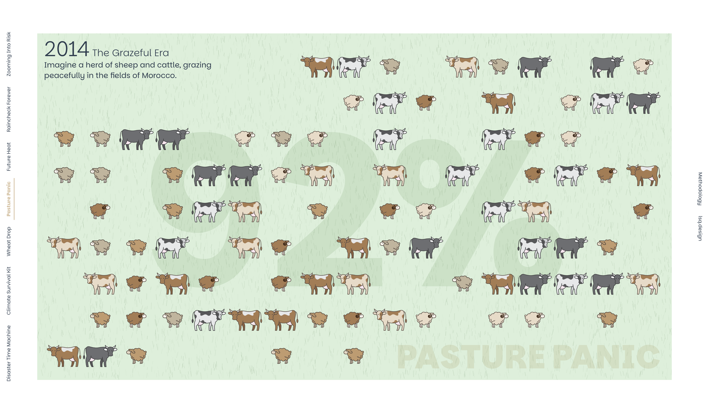
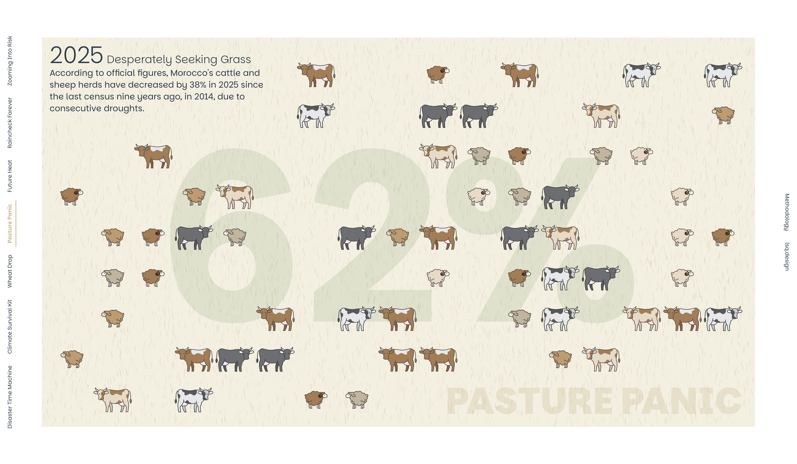

# Droughts, Floods, and Fires
## A Case Study of Morocco & Climate Change

Lisa Sakai Quinley

M.S. Data Visualization Candidate, Parsons School of Design
B.F.A. Communication Design, Parsons School of Design
B.A. Global Studies, Eugene Lang College of Liberal Arts

**Thesis Advisor:**

Daniel Sauter

Submitted in partial fulfillment of the requirements for the degree of Master of Science in Data Visualization at Parsons School of Design

May 2025

### Abstract

Six years of drought has damaged both Morocco’s agricultural output as well as its economy. The worsening drought and extreme weather events in Morocco are clearly due to climate change which is caused by increasing greenhouse gases. Morocco is used as an example of the kinds of challenges that a country and its people can face due to global warming. It is also clear that the coming decades will become even more difficult for societies to manage. Morocco has already adopted a variety of coping strategies, but there is more that needs to be done at the individual, community, and national levels to mitigate both the current situation and for the future. This thesis illustrates the story of the situation in Morocco as well as the kinds of actions needed. While the types of problems that arise varies greatly between countries, the story of Morocco is an example of the need for adaptation and mitigation that all countries around the world will need to face. I am particularly interested in Morocco due to the conditional acceptance I received to be a Climate-Smart Youth Development Facilitator as a Peace Corps Volunteer starting later this year. My role would include fostering climate-aware youth leaders.
 
### Acknowledgments

I would like to express my deepest gratitude to my thesis advisor, Daniel Sauter, whose insight, encouragement, and unwavering support were instrumental throughout this process. His ability to challenge my thinking, provide clarity and encouragement when I felt overwhelmed, and connect me with valuable resources was essential in shaping both my thesis and my growth as a data visualization designer and storyteller.

I am deeply grateful to Bernadette Ludwig, who guided me during my Global Studies undergraduate program at Eugene Lang and supported my passion for combining global studies, graphic design, and children’s education. Her encouragement to expand my Parsons Senior Thesis on gender equality in children’s books and her thoughtful recommendation were pivotal to my academic path. Her belief in interdisciplinary thinking continues to inspire my work.
I would also like to thank Laurie Berger and Debbie Lofaso, my mentors at Benchmark Education Co., whose steadfast support of my dreams for higher education and career growth in design has meant so much to me. Their guidance, encouragement, and confidence in my abilities not only strengthened my resolve to pursue this degree but also shaped the way I approach creativity and learning in meaningful, lasting ways.

I am also profoundly grateful to the Data Visualization cohort of 2024–2025. Being part of this driven and compassionate group made the demands of an intense, one-year, full-time program not only manageable but enriching. Their daily collaboration, honest feedback, and quiet but powerful emotional support—especially during challenging personal times—meant more than words can express.
I would also like to acknowledge the assistance of ChatGPT, developed by OpenAI. Its support was invaluable in helping me troubleshoot coding issues that I could not resolve through other resources, understand the nuances of Chicago-style formatting, and navigate complex features in Microsoft Word more efficiently.

Finally, I would like to thank my parents, Suomi Sakai and John Quinley, for their unwavering belief in me. Their love and encouragement have been the foundation of all my pursuits, and I am forever grateful for the opportunity to follow my passion.

### Table of Contents
1. Introduction
2. Morocco: A Country in Context
3. Facing the Storm: Extreme Weather Events
4. Unpacking the Crisis: Causes and Contributing Factors
5. Coping Strategies: How Morocco is Responding
6. Looking Ahead After Reviewing the Past
7. Politics and Progress: The US Climate
8. Research Framework and Methodology
+ Data Collection and Sources
+ Visualizing the Story: Key Design Decisions
    - Overall Project Tactics
    - Zooming Into Risk
    - Raincheck Forever
    - Future Heat
    - Pasture Panic
    - Wheat Drop
    - Climate Survival Kit
    - Disaster Time Machine
9. Conclusion: Reflections and Next Steps
10. Bibliography
11. Appendices

### Introduction
News reports have been filled in recent years with examples of extreme weather events. The Los Angelos wildfires in early January caused by dry conditions led to the loss of lives and the destruction of thousands of homes and businesses. Hurricane Helene flooded parts of the southeast United States leading to at least 219 deaths and an economic impact of $78 billion. An extreme heatwave in Saudi Arabia during the Haj pilgrimage season saw temperatures of at least 43C (109F) every day from 1-22 June and 1,301 deaths, mostly attributed to the heat. A prolonged drought in southern Africa led to a total grain production drop of 50% in Zambia. Typhoon Yagi struck China, Vietnam, Laos and Myanmar with over 700 deaths reported and extensive flooding and wind damage. Climate scientists are realizing that these extreme weather events are a natural consequence of the overall global warming due to increased emissions of greenhouse gases. 

Morocco is in its sixth year of a drought that is damaging its agricultural sector and overall economy. In addition to the drought, Morocco has had extreme heat waves and local torrential rains with flooding. The country has a Mediterranean climate in the north and becomes increasingly arid in the south. Weather in Morocco has always been highly variable with good years and bad years depending on precipitation.  However, this multi-year drought appears to be tightly linked with and is predicted by the effects of global warming. The most vulnerable groups are the roughly one third of the population living in rural areas who are small-scale farmers and herdsmen, as well as traditional oasis-dwellers and nomads.  Morocco has been engaged in a variety of coping mechanisms for the drought, including dams to store water, using well water, traditional water management systems like khettaras, and desalination. On the water use side, Morocco has been promoting drip irrigation, re-use of treated wastewater, and restriction of water use in urban areas to conserve water resources. Unfortunately, climate models predict that depending on continued greenhouse gas emissions, the situation will continue to worsen over the coming decades.  Within the country, youth need to understand the situation and what can be done at the individual, community, and national level. However, the drivers of climate change are not controlled by any one country and people need to understand the global sources and the role of all countries in preventing and mitigating the impacts of climate change.

The purpose of this project is to create visuals–such as infographics and diagrams–that can be used to illustrate the situation and coping mechanisms for Morocco. These products, or pages, are designed to appeal to an American audience, however, if I end up volunteering in Morocco, I will need to revisit and redesign them with people who understand the local culture. And though redesigning these graphics to be culturally and aesthetically appropriate for a Moroccan public is important, the project is first and foremost aimed toward a youth audience. My project aims to provide a bridge between complex statistical and analytical data on the country’s climate situation and young people who are our proponents for solutions and steps toward reducing the consequences of global warming. I provide visuals that can be used as tools individually or together to teach and illustrate what has happened, what is happening, and what could happen because of climate change in Morocco.

For human-related climate change, there are a wide variety of analyses already available from international organizations. There are several sources regarding fossil fuel use, atmospheric greenhouse gases, and climate change. Based on the literature review, these include UN agencies, US government agencies and academic and NGO data repositories. An example of a relevant data file I have found is from the Climate Change Dashboard of the International Monetary Fund (IMF). Groups such as the World Weather Attribution attempt to determine whether specific extreme weather events are likely to have been caused by or are related to climate change. Information about the impact on Morocco and coping mechanisms are found in organizations such as the Food and Agricultural Organization (FAO) and the United States Department of Agriculture. Specific actions are often reported in local and international newspapers.

### Morocco: A Country in Context

Morocco’s six years of drought has greatly reduced agricultural output and affected its economy.  The situation has become dire enough that “King Mohammed VI has urged his fellow Moroccans not to slaughter sheep for [the] upcoming Eid al-Adha festivities in June 2025 as the country grapples with dwindling herds.”  Morocco is a majority Muslim country and Eid al-Adha is a major holiday where Muslim families slaughter a sheep or goat and share it with their neighbors. Being able to engage in this celebration is an important part of their culture. Morocco has lost 38% of its cattle and sheep populations since the last census in 2016 due to drought.  The shortage of livestock has intensified inflation in the country. The NGO, Moroccan Center for Citizenship, surveyed families last year and 55% “…said they struggled to cover the costs of buying sheep and the utensils needed to prepare them…” This “tradition [is] so embedded that families have been known to take out loans to buy [a] sheep.” 

It is not just livestock that is affected by the drought. Morocco’s two largest cereal crops are wheat and barley. The severe drought of 2024 led to a drop in production of 40-50% for both crops compared to the previous five years.  Wheat is primarily used to make bread, Morocco’s staple food, and the government has had to import millions of tons of wheat to make up the difference caused by this deficit.  Irrigated crops represent only 16% of the total cultivated land but account for 75% of the value of Morocco’s agricultural exports.  But due to low water levels in dams across the country, the amount of land that can be irrigated has contracted.  

Morocco has been impacted by other extreme weather events over the years. A heat wave in April of 2024 resulted in the deaths of at least 21 people in the central city of Beni Mellal according to the Moroccan Health Ministry. Temperatures reached up to 48°C (118°F).  In late September of 2024, torrential rains triggered flooding in southern parts of Morocco, killing at least 28 people. The area where the flooding occurred is not within Morocco’s main agricultural areas, so it did not break the drought.  
Morocco is a country of contrasts. Central north, with the capital, Rabat, and the largest city, Casablanca, are along the Atlantic Coast and are in a hot summer Mediterranean climate area, as is most of southern Spain and Portugal. This area typically receives rainfall in the winter and is dry in the summer.  It is the location of a majority of Morocco’s irrigated farms and rain-fed cereal crops.  The Atlas Mountains cross the middle of the country and are so high that there are ski resorts with a height as high as 3,200m (10,000ft).  This mountainous region has a cold, semi-arid climate with hot, semi-arid areas at the base where oases are found. Both areas contribute to Morocco’s pastureland. The mountains are mainly inhabited by the indigenous Berber peoples who make up almost a third of the Moroccan population.  On the south side of the mountains lies the Sahara Desert with a hot, desert climate. 

About one third of the country’s population is rural and most are small-holder farmers or herdsmen. These groups are the most vulnerable to drought, along with oases-dwellers and Morocco’s small population of nomads. 

### Facing the Storm: Extreme Weather Events
It is well known that Morocco has always been prone to extreme weather events. Cancellation of the Eid al-Adha slaughter of sheep has occurred before: three times during the reign of King Hassan II, and one of these times being due to drought.  Rainfall and agricultural production vary considerably from year to year.  Some Moroccan experts state “that Morocco has always been a country of drought. This is structural, not something new.”  They do not see the current problem as being the drought, but that Morocco’s agricultural policies have called for increasing yields far beyond what is sustainable given the variable climate. In particular, the irrigated lands which are heavily export-oriented, use most of the available water from dams. The government has prioritized expansion of irrigation-focused infrastructure as part of its Green Morocco Plan. 

Other experts warn that while Morocco does have a history of droughts and other extreme weather events, careful studies have shown that this time is different. Increased average temperatures have been documented over the past one hundred years and climatologists have said that this has led to a shift of cloud patterns to the north, resulting in a 20% decrease in average precipitation over the country.  Climate change has also been associated with an increase in the severity and frequency of extreme weather events, not just in Morocco, but globally.  This trend would require a deep rethinking of how Morocco approaches these problems since even if the current drought breaks, the new normal is hotter and drier than the past and may be beyond the historical capacity of the country to adapt.

To measure the risk of disasters, a group at a university in Belgium has created EM-DAT,  a database that collects information on a variety of disasters, both natural and manmade, using consistent methods over many years. This has become a central resource for persons who are interested in disaster prevention and response. A subset of these disasters are extreme weather events closely related to climate change. These include droughts, wildfires, heat waves, cyclones, and floods. A selection of these was used by a group at the European Commission to make the Hazard & Exposure Index portion of an overall INFORM Risk Index. The INFORM Risk Index also includes Vulnerability and Lack of Coping Capacity.

### Unpacking the Crisis: Causes and Contributing Factors
Due to Morocco’s variable climate, even during the French colonial period, dams were constructed to provide a steady water supply for cities. In 1967, King Hassan II declared a goal of building more than one dam per year with the goal of increasing the area of irrigated agriculture from only 150,000 hectares to 1 million hectares by the year 2000.  While numerous dams were built that could achieve this goal, they depend on rainfall to be filled. In 2024, the worst year of the drought so far, the dam-irrigated area dropped to 400,000 hectares from 750,000 hectares before the drought. 

Ground water accounts for 20% of total water resources in Morocco.  The main type of water includes boreholes with electric pumps, although there are also traditional hand-dug wells. This contributes to the water used for irrigation but is also used for drinking water and for herd animals. Ground water has been over exploited, leading to a rapid drop in the water table. Many wells have been running dry. In the presence of drought, recharge of the aquifers slows, making the situation worse. Experts point to Morocco’s historical adaptations to limited water supplies. 

Morocco has a long history of using traditional water systems called khettaras.  These are especially used in oases at the base of mountains. They are made by digging a shaft on the hillside until it reaches the water table, then a series of wells are dug and connected underground to make a gently inclined horizontal tunnel leading towards the oasis. The water from the water table flows by gravity and so no pumping is needed. In the 1970s, overuse of diesel pumps and vertical wells have lowered the water table, causing some of the khettaras to dry up. 

The process of desalination removes salt from sea water. It is being used on an increasingly large scale around the world but is energy intensive. Therefore, this is an expensive approach compared to other sources of water. Morocco is rapidly building desalination plants to reach a level of 1.4 billion m3 production level by 2030.  This compares to a total production capacity of only 192 million m3 per year in 2023. Most of these plants are to be powered by renewable energy sources. The desalinated water will be primarily used as drinking water for urban areas since it is too expensive for nearly all other agricultural needs. However, it will reduce the demand from cities on dam water.  

Morocco is taking a variety of measures to increase the efficiency of water use. In urban areas, treated wastewater is being used for irrigation or green spaces, instead of being discharged into the ocean. During the drought, cities have also taken measures such as banning water use for street cleaning, irrigating urban parks, or washing cars.  In irrigated agricultural areas, they have been promoting drip irrigation so that the available water can go farther. 

However, one must remember that despite all these methods, the demand for water still exceeds the supply. It is the large, rural population of small-scale farmers without access to irrigation who are the most vulnerable to decreasing rains. Their other main source of water from wells is declining and the various measures being taken will not help this. This large population of rural dwellers depends primarily on agriculture for their income. Repeated crop failures or loss of livestock leads to their impoverishment, eventually many quit farming and move to the cities.  The inability to cope with climate-related disasters for this group has put a strain on the country and leads to more inequality in the society. This is measured by the section of the INFORM Risk Index that relates to Vulnerability.

There is also a section on Lack of Coping Capacity. This is determined by several measures of government effectiveness and coverage of basic services and infrastructure. Morocco scores in the middle according to this index, much worse than wealthy countries, but much better than the poorest.

### Coping Strategies: How Morocco is Responding

An accurate understanding of the earth’s climate both in the past and the prospects in the future have only recently become available. While historical accounts of droughts, floods, and other natural disasters exists throughout the world, there was no way to measure what these meant in terms of the overall climate. And where the climate was going was anyone’s guess. It is understandable that individuals and whole societies mistakenly attribute extreme weather events to natural variability and fail to see the underlying influence of global climate change. Over the past fifty years, climate scientists have been able to use a variety of methods to understand the world’s climate far into the past and have developed increasingly powerful computer models that allow them to predict climate change in the coming decades.  One task is to make this science better known so that people realize there is a human cause for these problems and the potential for a human solution.

In terms of what the models say about Morocco, there are multiple scenarios. Some of these include very optimistic assumptions where greenhouse gases stop rising globally and even start to fall. The worst scenarios are business-as-usual, where greenhouse gases and their effects continue to rise and become worse. Current policies around the globe are closer to the business-as-usual scenario. Under these predictions, Morocco will experience steadily increasing heat and steadily decreasing precipitation over the next fifty years. 

### Looking Ahead After Reviewing the Past
The scientific basis of understanding earth’s climate developed gradually in the 1800s. For example, John Tyndall and Svante Arrhenius made key contributions to understanding how gases like carbon dioxide and water vapor trap heat. This laid the foundation for the theory of the greenhouse effect. At the same time, industrialization led to the development of fossil fuels as the primary energy source. After World War II there was a global economic boom which increased the use of fossil fuels and greenhouse gas emissions. In 1958, C. David Keeling of the Scripps Institute began measuring CO2 levels in the atmosphere on Mauna Loa in Hawaii. These measurements have continued under the National Oceanic and Atmospheric Administration (NOAA) and show a steady increase in CO2 every year. They were the first direct evidence that greenhouse gas levels in the atmosphere were increasing.  

In 1988, James Hansen, a NASA scientist, testified to the US Senate that (1) “[t]he Earth is warmer than at any other time in recent history,” (2) “[t]his global warming can be attributed, with 99% certainty, to a man-made increase in the greenhouse effect, primarily from the burning of fossil fuels and changes in the way we use land,” and (3) “[t]his greenhouse effect is making extreme weather events like heat waves, storms, and droughts more frequent and intense.”  Although controversial in its time, his statements were pivotal in raising global awareness of the climate crisis and have been proven repeatedly by subsequent events. Following this came several international agreements to help curb greenhouse gas emissions. These include the 1992 Rio Earth Summit during which the United Nations Framework Convention on Climate Change (UNFCCC) was adopted, the 1997 Kyoto Protocol, and more recently the 2015 Paris Accords which the Trump administration has now abandoned twice. 

Morocco is leading the way with solar and wind power. The country has had a rapid expansion of solar power facilities developed and has big plans.  Given that it has large plots of land suitable for solar and wind power production that are otherwise not being used much, Morocco has ambitious targets to increase energy production and reduce reliance on fossil fuels. It even has begun exporting clean energy to countries in Europe. 

### Politics and Progress: The US Climate
With the start of the Trump administration on January 21st, 2025, the United States government has been taking measures to promote fossil fuels, renege on climate agreements, discourage renewable energy, and cancel foreign aid, all while claiming that climate change is a hoax. This project is meant to present the evidence that clearly shows climate change is real, it is caused by greenhouse gas emissions primarily from wealthy countries and in addition to global warming, it is clearly linked to extreme weather events. And while these events impact all countries, they disproportionately affect lower- and middle-income countries (LMIC) who have less capacity to adapt. Instead of taking a leadership role in dealing with climate change, the current administration is choosing to ignore and deny the problem.

While we hope the United States might change their approach, citizens of any country can take the initiative to inform themselves about the issues and support measures to control climate change and mitigate its effects. Morocco is the study country which I investigate in this project because it is a middle-income country that has the capacity to take measures. I am hopeful that materials for the Thesis could be used. It could contribute to discussions in Morocco about climate change and further aid in youth education.

### Research Framework and Methodology
#### Data Collection and Sources
Morocco’s climate situation is nuanced, with lessons that can be learned from what the country is engaging in to mitigate the consequences. I analyzed and parsed through various data sources and articles for different aspects of the situation in Morocco. Publicly available quantitative data was gathered from the following trusted sources: the Joint Research Centre of the European Commission; the World Bank’s Climate Portal; the United States Department of Agriculture (USDA); and the Centre for Research on the Epidemiology of Disasters (CRED) part of the University of Louvain (UCLouvain). News articles were used for quantitative information on Morocco’s climate situation and coping mechanisms such as: the Guardian, Reuters, the New York Times, and the BBC.

The INFORM Risk Index is a global tool that measures the risk of humanitarian crises and disasters by evaluating a country's exposure to hazards and its ability to manage them. Created by the Joint Research Centre of the European Commission, it is built on three key dimensions: Hazards & Exposure, which assesses the likelihood and intensity of natural and human-made hazards; Lack of Coping Capacity, which gauges the availability of infrastructure, governance, and early warning systems to manage crises; and Vulnerability, which looks at the susceptibility of people, based on factors like poverty, inequality, and development levels. Together, these categories help identify countries most at risk and guide disaster preparedness and response efforts. It allowed me to have a consistent way to compare Morocco’s climate risk to other countries.

The World Bank’s Climate Change Knowledge Portal is an online platform that provides climate data and analysis tools to support decision-making around climate resilience and adaptation. It provides historical weather data, climate projections, and climate risk assessments for specific countries and regions, including Morocco. Users can explore information on temperature, precipitation, sea-level rise, and extreme weather events. The portal offers easy-to-navigate visualizations and downloadable data. Although the downloadable data is also available through an API, I found the UI for that section to be tremendously difficult to navigate but was able to download needed data from links connected to the portal’s own visualizations.

The USDA’s Foreign Agricultural Service (FAS) provides detailed data and analysis on Morocco’s agricultural sector. Reports on Morocco’s wheat and barley showed how production has been impacted by drought, leading to increased imports; for example, the 2024 crop season saw wheat and barley production drop by about 43% compared to previous years.

The Centre for Research on the Epidemiology of Disasters (CRED), based at the Université catholique de Louvain (UCLouvain) in Brussels, Belgium launched the Emergency Events Database (EM-DAT) to provide comprehensive data on the occurrence and effects of over 26,000 mass disasters worldwide from 1900 to the present. They use standard definitions to categorize the type and size of disasters from multiple sources, including UN agencies, non-governmental organizations, insurance companies, research institutes, and press agencies. EM-DAT is widely used to aid in disaster preparedness, risk assessment, and policymaking. For the purposes of my project, I specifically used the data regarding climate-related disasters.

News articles and websites from various sources are referenced for the non-quantitative aspects of the project, particularly Morocco’s coping mechanisms. These sources include explanations, images, and diagrams that outline the country’s strategies and ongoing efforts to manage the effects of drought. Measures include building additional dams, using well water, and relying on traditional water management systems such as khettaras. Morocco is also deploying more desalination plants. To conserve water and reduce excessive usage, the country promotes drip irrigation, reuses treated wastewater and imposes water restrictions in urban areas.

#### Visualizing the Story: Key Design Decisions
##### Overall Project Tactics
Seeing as this project aims to engage and educate a non-scientific youth audience, I separated out categories or stories on specific topics within the country from the assembled data. The difficulty lay in finding a balance between retaining the complexity of the data, displaying said information as a story, and maintaining the attention of a young audience without simplification or “dumbing down the data”. The final project consists of seven graphics that are used together but can also work as standalone visualizations to illustrate Morocco’s climate situation. Each visualization communicates a key message: where Morocco is situated within the global landscape; the historical and projected annual precipitation and its decline; the historical data and projected scenarios of increasing surface air temperatures; the reduction of cattle and sheep herds due to droughts; the decrease in wheat yielded and land seeded for wheat during drought and non-drought years and the most recent statistics; Morocco’s coping mechanisms; and the increasing number of climate change-related disasters worldwide that have occurred from 1999 to now.

Drawing on my experience as a graphic designer at an educational publishing company, where I created materials for teachers and students from kindergarten through 12th grade, I approached the project with a storytelling mindset from the initial sketching phase. Recognizing that not all viewers may be familiar with Morocco or able to place it within a personal context, I designed the narrative to begin with a global perspective, narrow in on the country, and then expand outward again by the project’s end. To make the visualizations more accessible and engaging for a younger audience, I deliberately used playful language, incorporating puns, alliteration, and casual slang to invite curiosity and make complex topics feel more approachable. Apart from the animated illustration on Morocco’s coping mechanisms, all country-specific data visualizations were designed to be adaptable for other nations, with the hope that they can be repurposed and built upon in future projects.

Instead of relying on a scrollytelling library like Scrollama, I implemented scroll-based transitions using the native Intersection Observer API. This allowed for precise control over when dynamic elements should animate in sync with narrative components as users scroll through the page. I used Vue.js to manage the application's UI state and modular component structure, which enabled smooth interactivity without components interfering with one another. The Intersection Observer ensures that as users enter a new section, only the relevant animations are triggered while any previous ones are halted, significantly reducing visual glitches. For data visualizations, I integrated D3.js to take advantage of its fine-grained control over SVG elements and transitions—ideal for crafting custom visuals such as interactive maps, charts, and animations. One exception is the “Climate Survival Kit” page, which displays the country’s coping mechanisms, and which was created entirely in Adobe Illustrator and After Effects. It features an illustrated video exploring Morocco’s past, present, and future water usage and conservation strategies, as well as the projected impacts of global warming.

##### Zooming Into Risk
To situate Morocco within the global context of climate risk, I used the INFORM Risk Index in combination with a geographic visualization built using Leaflet.js. As shown in Figure 8.1, the section titled Zooming Into Risk, users can click on any country to view its overall risk score along with the three contributing dimensions: vulnerability, hazard and exposure, and lack of coping capacity. Radio buttons enable users to toggle between the overall INFORM Risk Index and its individual components on a global scale. To ensure accessibility and clarity, hovering over each radio button reveals a brief, easy-to-understand description of the selected category or index. Additionally, users can select up to ten countries for a more detailed side-by-side comparison, as illustrated in Figure 8.2. Although the INFORM Risk Index classifies countries into qualitative risk levels—Very Low, Low, Medium, High, and Very High—I chose to visualize the data using a color scale divided into two-point intervals: green, yellow, orange, red, and purple. This palette is used consistently throughout the project and was intentionally chosen for its emotional impact—its bold, high-contrast tones are designed to evoke urgency and give the visualizations a strong, almost confrontational energy.

*Figure 8.1: Zooming Into Risk – Morocco View*

*Source: Lisa Sakai Quinley, based on INFORM Risk data from the Joint Research Centre of the European Commission*

*Figure 8.2: Zooming Into Risk – Morocco & United States Comparison*

*Source: Lisa Sakai Quinley, based on INFORM Risk data from the Joint Research Centre of the European Commission*

##### Raincheck Forever
Raincheck Forever, the second visualization, combines historical data with the most severe scenario from the World Bank’s Climate Portal projections to highlight Morocco’s declining annual precipitation. Animated as falling raindrops that stack to form a bar chart, the visualization uses color to distinguish between historical and projected data. As shown in Figure 8.3, hovering over a year reveals a solid bar to help users identify the specific year and displays the actual precipitation in millimeters. A linear regression line was included to underscore the overall downward trend. This visualization was also designed with screen diversity in mind, recognizing that many young people primarily access content through their phones. One intentional design choice was to make the raindrops responsive to the height and width of the browser window, with each drop representing either 5mm or 10mm of rainfall depending on the screen size, ensuring clarity and engagement across devices. In future iterations, I aim to incorporate brief, written insights summarizing the key takeaways from the data—beyond relying solely on the trend line. I also plan to implement an automatic unit conversion feature that switches between millimeters and inches depending on the user's regional settings or preferences, to make the data more accessible to diverse audiences.

*Figure 8.3: Raincheck Forever – Morocco’s Historical and Projected Annual Precipitation*

*Source: Lisa Sakai Quinley, based on World Bank Climate Portal data*

##### Future Heat
Based on the World Bank’s Climate Portal data for Morocco, Future Heat—the third page—visualizes both historical records and four projected climate scenarios using heatmaps to display maximum and mean surface air temperatures by year and month. The visualization intentionally plays on the term “heatmap” both in form and content. As shown in Figure 8.4, users can hover over red overlays—which deepen in color based on scenario severity and include a playful sparks animation evocative of flames—to temporarily reveal the heatmaps beneath. This visual metaphor reinforces the thematic framing of climate scenarios through the lens of fire. For a more in-depth exploration, users can choose to remove the covers entirely. Radio buttons allow users to toggle between viewing maximum or mean temperature data. To clearly distinguish between past and future data, I used grayscale for historical records (suggestive of ash) and the vibrant palette (used in the previous visualizations) for projections, emphasizing the contrast. Each scenario is introduced with playful, fire-themed titles and short, accessible one-liners, along with longer summaries written in everyday language to make the content of the heatmaps more approachable. To accommodate a broader audience, the temperature legend automatically switches between Celsius and Fahrenheit.

*Figure 8.4: Future Heat – Morocco’s*

*Source: Lisa Sakai Quinley, based on World Bank Climate Portal data*

##### Pasture Panic
The fourth visualization, Pasture Panic, illustrates the decline of sheep and cattle herds in two parts. When users enter the viewport, they see a green background with 100 animal icons—four variations each of sheep and cows—representing the total herd size in 2014. A bold “100%” appears in the background, and the scene is titled The Grazeful Era, a pun designed to engage younger audiences. The animation begins immediately: the 100% count starts ticking down, and with each decrease, a random animal disappears from the pasture as the background gradually shifts from green to brown as shown in Figure 8.5. By the end, viewers see 62 animals on a dry brown field, with “62%” displayed behind them. As show in Figure 8.6, the title and text also update to 2025: Desperately Seeking Grass, explaining that “according to official figures, Morocco’s cattle and sheep herds have decreased by 38% since the last census in 2014, due to consecutive droughts.” While exact numbers varied across sources, the consistent pattern of decline is clear.

*Figure 8.5: Pasture Panic – 2014: The Grazeful Era*

*Source: Lisa Sakai Quinley, based on a variety of data sources and news articles*

*Figure 8.6: Pasture Panic – 2025: Desperately Seeking Grass*

*Source: Lisa Sakai Quinley, based on a variety of data sources and news articles*

##### Wheat Drop
Wheat Drop, the fifth page, introduces a set of three sequential, layered graphics—The Feast Before the Flame, Scorched Rhythm, and Echoes of a Vanished Spring—that narrate Morocco’s declining wheat production through visual storytelling. Rather than relying on conventional bar graphs, this section draws from data provided by the United States Department of Agriculture and transforms it into a more narrative-driven format. After analyzing yearly data from 2014 to 2025 (Table A.1), I chose to compare the average values from non-drought years (2014–2019) with those from drought-affected years (2019–2024). The stark contrast, especially when viewed against the sharp drop reflected in the most recent data from 2025, prompted the creation of a dedicated graphic to highlight that year (Table A.2).

The first graphic, The Feast Before the Flame (Figure 8.7), depicts the average wheat yield and hectares of land seeded between 2014 and 2019—a period unaffected by major drought. Each wheat icon, created in Adobe Illustrator, represents 10,000 tons of wheat, with a total of 607 icons animating into the scene. These icons appear over a brown rectangle symbolizing land, which serves as the base for both text and imagery. In the upper right corner, a counter climbs from 0 to 607 to reflect the total wheat tonnage. The land area is also textually represented as 299 units, each equaling 10,000 hectares.

After a brief three-second pause, the second graphic, Scorched Rhythm (Figure 8.8), animates into view. The brown rectangle here is noticeably shorter, reflecting a 12% drop in seeded land. A numerical animation counts down from 299 to 262, while only 420 wheat icons enter the frame—again accompanied by a counter falling from 607 to 420. This scene represents the average yield and land area during the drought-affected years of 2019 to 2024.

The final graphic, Echoes of a Vanished Spring (Figure 8.9), builds on this downward trend by showing data from 2024–2025. The land area decreases by another 14%, shrinking from 262 to 220 units, while wheat yield falls from 420 to just 246 ten-thousand-ton icons—visually and numerically illustrating the deepening agricultural decline.

Figure 8.7: Wheat Drop – The Feast Before the Flame
Source: Lisa Sakai Quinley, based on United States Department of Agriculture data

Figure 8.8: Wheat Drop – Scorched Rhythm
Source: Lisa Sakai Quinley, based on United States Department of Agriculture data

Figure 8.9: Wheat Drop – Echoes of A Vanished Spring
Source: Lisa Sakai Quinley, based on United States Department of Agriculture data
